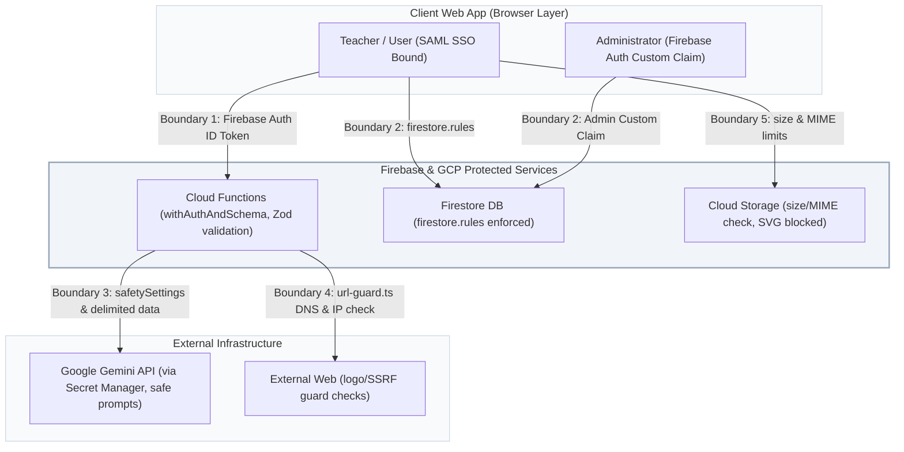

# Security Policy & Remediation Advisory — TASC Tools4Schools

This document outlines the security architecture, threat model, and historical security remediation records for the **TASC Tools4Schools** platform. It serves as both a reference for developers maintaining the application and a public security record for the GitHub repository.

---

## 1. Security Posture Summary

In May 2026, a comprehensive **Code-Red Security Assessment** was performed on the codebase. All identified vulnerabilities were remediated directly in the source code. The project's security posture has transitioned from a **CRITICAL** risk rating to a verified **LOW** residual risk rating.

### Remediation Scorecard

| Severity | Identified | Remediated | Remaining | Primary Mitigation / Resolution |
| :--- | :---: | :---: | :---: | :--- |
| **CRITICAL** | 11 | 11 | 0 | Removed hardcoded secrets; restricted Firestore roles; hardened functions; enforced SAML SSO caller boundary; closed SSRF vectors. |
| **HIGH** | 13 | 13 | 0 | Enforced HTTPS scheme validations; blocked XSS vectors (SVGs); added strict Zod schemas; set Gemini safety boundaries; injected security headers. |
| **MEDIUM** | 12 | 12 | 0 | Blocked client-side field updates (like `role`); restricted Storage paths; implemented weighted per-user AI daily budget meters. |
| **LOW** | 7 | 6 | 1 | Resolved logo heuristic bugs; safe-validated photo URLs; added robust logger hashes. (L5 registrable-domain heuristic accepted). |

> [!NOTE]
> All automated tests, TypeScript checks, and production builds now pass clean against the authoritative latest security patches (including Firebase v12/v13, Vite v8, and Tailwind v4).

---

## 2. Trust Boundaries & Threat Model

The platform enforces five strict trust boundaries to isolate credentials, authenticate users, protect external systems, and moderate generated content.



### Boundary Details

1. **Browser ↔ Cloud Functions**: Authenticated via Firebase Auth ID tokens bound strictly to **TASC SAML SSO**. No public sign-up or registration exists. Every callable function is protected by `withAuthAndSchema` wrappers that validate authenticated status and parse payloads through strict, non-permissive Zod schemas.
2. **Authenticated User ↔ Firestore**: Governed by `/firestore.rules`. User profiles can only be written by the owner, whitelisting specific fields. Writing to the `role` field is strictly rejected by rules; the authoritative admin flag is handled solely through Firebase Auth **Custom Claims**. Reviews are restricted to one per user per tool and require a matching `auth.uid`.
3. **AI Moderation ↔ Admin decision**: Draft vetting notes are generated by the Gemini model but are marked as strictly *advisory*. The Admin UI presents a prominent visual warning that compliance fields are AI-derived and must be verified by a human administrator before publication. Prompts isolate untrusted content inside named `<user_query>` or `<tool_name>` delimiters.
4. **Cloud Function ↔ External HTTP**: Outbound scraping flows for tool URLs are protected by `functions/src/lib/url-guard.ts`. This resolves DNS and screens hosts prior to connection, explicitly blocking loopback (`127.0.0.1`), private ranges (`RFC1918`), link-local (GCP metadata endpoints like `169.254.169.254`), unique-local, and IP literals. Outbound fetches enforce `redirect: 'manual'` (ignoring 30x redirections) and a 3-second abort timeout.
5. **Browser ↔ Firebase Storage**: Governed by `/storage.rules`. User avatars and site assets are restricted by size (< 2 MB) and MIME types (`image/jpeg`, `image/png`, `image/webp`, `image/gif`). **SVG files are explicitly rejected** because they can embed script tags (`image/svg+xml`) that execute within the web browser origin context.

---

## 3. Vulnerability Breakdown & Remediations

Below is the detailed registry of critical and high-severity issues identified and corrected in the source code.

### 🔴 Critical Vulnerabilities Remediated

> [!CAUTION]
> Historical versions of this codebase prior to release `v1.1.0` contained the issues described below. Do not roll back to these commits.

#### C1: Firebase Service Account Credentials Exposed on Disk
* **Risk:** Attacker with read access to the repo or builder filesystem could extract full administrative access.
* **Resolution:** Deleted `serviceAccountKey.json` and the legacy `firebase-admin.ts` file. Server-side initialization now relies exclusively on **Application Default Credentials (ADC)** which use the runtime's safe workload identity instead of static files.

#### C2: Gemini API Key in Environment Variables
* **Risk:** Key leakage through local configuration files, build logs, or accident commits.
* **Resolution:** Removed `.env` and `validate-key.mjs`. All Gemini interactions now map to GCP Secret Manager via `apphosting.yaml` configurations and are injected securely into Cloud Functions using the `secrets` declaration.

#### C3: Unauthenticated Access to AI Callables
* **Risk:** Public actors could query Gemini endpoints directly, triggering high API costs.
* **Resolution:** Wrapped all callables in a custom `withAuthAndSchema` decorator. Anonymous execution is blocked; inputs are verified via strict schemas; concurrency and execution parameters are locked down.

#### C4: Tool Submissions via Client-Write Access
* **Risk:** Attackers could bypass validation checks and write malicious tool details directly to the database.
* **Resolution:** Removed direct write rules on `/ai_tools` and routes submissions through a hardened `submitTool` callable function. The function applies a strict schema, controls creation timestamps/status, and enforces a daily rate limit of **5 submissions per user**.

#### C5 & C6: Server-Side Request Forgery (SSRF) in Image & Vetting Finders
* **Risk:** The server could be tricked into querying internal network endpoints, including GCP metadata endpoints (`169.254.169.254`), exposing access tokens or internal servers.
* **Resolution:** Introduced a DNS resolver validator (`url-guard.ts`) that checks IP resolutions and blocks private/local IP spaces before sending HTTP packets. Disabled redirect following and set strict 3-second timeouts.

#### C7: Prompts Vulnerable to Injection & Moderation Bypass
* **Risk:** Malicious site content or search queries could break out of prompts to bypass classification logic.
* **Resolution:** Implemented explicit XML-style markers (`<user_query>`) around untrusted variables, set system instructions to treat data as passive variables, enabled Gemini `safetySettings`, and added an admin-approval dashboard requirement.

#### C8: Identity & Review Spoofing
* **Risk:** Authenticated users could overwrite their profile details in Firestore to impersonate admins or spoof review authors.
* **Resolution:** Locked `/users/{uid}` in `/firestore.rules` to prevent updates to `role` or other unauthorized parameters. Review authorship (`displayName` and `avatarUrl`) is sourced directly from **Firebase Auth** tokens in the page logic, not client-supplied form fields.

#### C9: Client-Side Privilege Escalation
* **Risk:** Users could pass `role: 'admin'` in user doc creations, granting themselves elevated permissions.
* **Resolution:** Modified rules to block writes containing `role`. Placed administrative authority solely in the custom token claim `request.auth.token.role`.

#### C10: Permissive Web Hosting Authorized Domains
* **Risk:** Permissive domains in configurations allowed staging or workstations to issue authentication requests.
* **Resolution:** Trimmed wildcard entries in `apphosting.yaml` to ensure only the production hostname (`tools4schools.tasc.nsw.edu.au`) is an authorized domain.

---

### 🟡 High Vulnerabilities Remediated

> [!WARNING]
> High-severity mitigations protect user sessions, browser origins, and budget metrics.

#### H1: Unsafe URL Redirect Scheme Handling
* **Risk:** Links like `javascript:alert(1)` could be stored and rendered inside `<a href>`, causing Stored XSS.
* **Resolution:** Added `safeUrl` helper which parses URLs using the browser's `new URL()` interface, strictly validating the protocol. Reject any URI that doesn't use `http:` or `https:`.

#### H2 & H3: XSS via SVG Image Uploads & Metadata Hijacking
* **Risk:** Uploaded SVG files containing inline scripts could be accessed on the hosting origin, executing scripts in the administrator's browser.
* **Resolution:** Restricted storage content types to a strict whitelist: `image/jpeg`, `image/png`, `image/webp`, and `image/gif`. SVGs are completely blocked from uploading.

#### H4: Image-Pixel Origin Leaks
* **Risk:** Third-party images loaded directly from unvetted domains could leak teacher IP addresses or user-agent details.
* **Resolution:** Integrated a `safeImageUrl` checker restricting image elements to firebasestorage and verified local domain pathways.

#### H5: Stack Trace Information Leakage
* **Risk:** Detailed backend error traces were passed straight to the client console, revealing internal logic.
* **Resolution:** The `withAuthAndSchema` decorator catches all unhandled backend exceptions, logs the error stack to GCP Cloud Logging for developers, and issues a generic `HttpsError('internal', 'An internal error occurred.')` to the user interface.

#### H8: PII in Application Logging
* **Risk:** User queries and personal information logged in plain text could violate privacy compliance policies.
* **Resolution:** Redacted query strings. Logs write structured objects containing hash strings (a 12-character SHA-256 hash of the query) instead of cleartext.

#### H9: Missing Content Security Policies (CSP)
* **Risk:** Vulnerability to clickjacking, mime-sniffing, or cross-site scripting due to lack of response headers.
* **Resolution:** Configured comprehensive security headers in `firebase.json`:
  ```json
  "headers": [
    {
      "source": "**",
      "headers": [
        { "key": "Content-Security-Policy", "value": "default-src 'self' ...;" },
        { "key": "X-Frame-Options", "value": "DENY" },
        { "key": "X-Content-Type-Options", "value": "nosniff" },
        { "key": "Strict-Transport-Security", "value": "max-age=31536000; includeSubDomains" }
      ]
    }
  ]
  ```

---

### 🟢 Medium Vulnerabilities Remediated

> [!TIP]
> Medium-severity updates control platform operations and prevent resource consumption attacks.

#### M4: API Consumption & Resource Abuse
* **Risk:** Scripted requests could flood the Gemini API, incurring massive bills.
* **Resolution:** Created an internal weighted **AI budget meter** in `functions/src/lib/rate-limit.ts`. Callables are assigned operational costs (e.g. search costs 1 unit, tool guide generation costs 5 units). Daily cap is set to **200 units per user** (administrators are exempt so as not to block moderation tasks).

#### M6: Storage Wildcards
* **Risk:** Excessively broad paths in storage rules allowed anonymous uploads to arbitrary directories.
* **Resolution:** Explicitly isolated directories (`/site/`, `/tools/`, and `/users/{uid}/`) and added a default catch-all deny rule at the root level.

---

## 4. Compliance & Alignment with OWASP Standards

The platform's security controls are aligned directly with industry-standard benchmarks. The remediation pass explicitly mapped core defensive controls to both the **OWASP Top 10 Web Application Security Risks** and the **OWASP Top 10 for LLM Applications** frameworks.

### 🌐 OWASP Top 10 (Web Application) Alignment

| OWASP Web Risk Category | Specific Platform Control & Mitigation |
| :--- | :--- |
| **A01:2021 — Broken Access Control** | Enforced by `/firestore.rules`. Prevented client-side mutations of security parameters (like `role`). Access controls utilize secure **Firebase Auth Custom Claims** (`request.auth.token.role`) instead of database-level fields. Review creation is bound strictly to `auth.uid` of the authenticated teacher. |
| **A02:2021 — Cryptographic Failures** | Removed all static administrative credentials (`serviceAccountKey.json`) and local environmental secrets (`.env`). Workloads utilize identity federation via GCP workload identities, and active API keys reside in GCP Secret Manager, preventing data-at-rest key exposures. |
| **A03:2021 — Injection** | Eliminated XSS vectors by blocking SVG uploads in rules and UI components. All inputs entering server-side functions pass through strict Zod schemas (`.strict()`). Standard URLs rendered in the interface undergo regex scheme validation (`safeUrl`), allowing only verified `http:` and `https:` protocols. |
| **A04:2021 — Insecure Design** | Established explicit trust boundaries, secure logging mechanisms, and threat-modeling (in `docs/security/THREAT_MODEL.md`), creating a decoupled validation architecture that ensures AI-based moderations are strictly advisory and human-in-the-loop checked. |
| **A05:2021 — Security Misconfiguration** | Configured robust CSP, HSTS, X-Frame-Options, and referrer headers in `firebase.json`. Restructured `apphosting.yaml` to remove wildcard workstations (`*.cloudworkstations.dev`) and temporary staging domains, locking authentication strictly to production boundaries. |
| **A06:2021 — Vulnerable & Outdated Components** | Upgraded core libraries (Vite 8, Tailwind 4, Firebase 12/13). Implemented automated `npm audit` gates in build pipelines to fail builds if critical dependencies carry open CVEs. Transitive dependencies are audited monthly (per `SECURITY-WAIVERS.md`). |
| **A07:2021 — Identification & Authentication Failures** | Authenticates solely via **TASC SAML Single Sign-On (SSO)**. There is no public registration, password database, or custom credential-recovery surface, eliminating credential stuffing, password cracking, or verification bypasses. |
| **A09:2021 — Security Logging & Monitoring Failures** | Configured redaction for Cloud Logging. Callables log anonymized transaction details and query-fingerprints (using secure 12-character SHA-256 hashes of string inputs) instead of raw text, protecting user privacy and preventing credential leaks in logs. |

---

### 🤖 OWASP Top 10 for LLM Applications Alignment

| OWASP LLM Risk Category | Specific Platform Control & Mitigation |
| :--- | :--- |
| **LLM01 — Prompt Injection** | Structured templates isolate untrusted queries and variables in strict XML-style blocks (e.g. `<user_query>`, `<tool_name>`). System instructions explicitly direct the Gemini models to treat contents inside these blocks as passive data only. |
| **LLM02 — Insecure Output Handling** | Draft compliance flags (`gdprCompliant`, etc.) are treated as unverified. The Admin UI presents a warning and requires hand-verification of the tool by an administrator before approval. Returned AI search IDs are dynamically validated against caller-supplied ID sets. |
| **LLM03 — Training Data Poisoning** | The platform processes only vetted tool databases and administrative inputs. External websites or third-party directories are never directly read or ingested into system pipelines until explicitly approved by human operators. |
| **LLM04 — Model Denial of Service** | Implemented a structured **AI budget meter** (`consumeAiBudget`) that applies cost weightings to calls. Enforces a strict daily limit of **200 units per teacher** to bound worst-case script abuse. Functions cap concurrency at 10 and instances at 5. |
| **LLM06 — Sensitive Data Disclosure** | API keys reside securely in GCP Secret Manager. User-specific personal credentials or SSO tokens are never processed by prompt scripts. Outputs and requests undergo hash-redaction prior to writing telemetry records. |
| **LLM08 — Excessive Agency** | AI outputs have **no write or execution privileges** on databases or GCP infrastructure. The model returns static structured JSON, which is parsed, validated, and processed exclusively through Cloud Functions and user UI triggers. |

---

## 5. Required Operator Configurations (Console Action Items)

To maintain a secure production state, system administrators must complete the following configuration steps in the GCP and Firebase consoles:

1. **Rotate Firebase Service Account Key**: If historical credentials were leaked, access must be revoked. Generate and rotate certificates on the service account page in the Google Cloud Platform Console. Do not upload the new key file to Github or local developer disks.
2. **Gemini API Key Setup**: Place the production API key inside Google Secret Manager under the name `GEMINI_API_KEY`. It will load automatically in the backend workload.
3. **Restrict GCP Web API Key**: Set HTTP referrer restrictions on the public Firebase Web API key (`AIzaSy...`) in the GCP Console to allow only `https://tools4schools.tasc.nsw.edu.au/*` and the local emulator context if debugging.
4. **Clean Authorized Domains**: Verify in the Firebase Console under **Authentication → Settings → Authorized domains** that wildcards or temporary workstations (such as `*.cloudworkstations.dev`) have been deleted, leaving only `tools4schools.tasc.nsw.edu.au` and `localhost` (for emulator testing).

---

## 6. Vulnerability Disclosure Policy

If you discover a security vulnerability in this project, please **do not open a public GitHub issue**. Instead, follow these steps to report it responsibly:

* **Contact**: Send a detailed report to the TASC Security Team at **security@tasc.nsw.edu.au**.
* **Details to Include**:
  * A clear description of the issue.
  * Steps to reproduce the bug (PoC script, request details, or screenshots).
  * The potential impact if exploited.
* **Response Cadence**:
  * We will acknowledge receipt of your report within **24 hours**.
  * A triage status update will follow within **3 business days**.
  * A remediation timeline will be coordinated with the reporter, aiming for a resolution within **30 days**.

---

## 7. Security Maintenance Cadence

To ensure dependencies do not introduce regression vulnerabilities, developers should perform the following operational tasks:

* **Weekly**: CI pipelines execute `npm audit --production --audit-level=critical`. New critical findings will fail build validation, blocking deployment until fixed.
* **Monthly**: Execute `npm outdated` and upgrade packages in `/functions` and `/` roots, prioritizing `firebase-admin`, `firebase-functions`, and `@genkit-ai/*`. Re-evaluate accepted dependency waivers in `SECURITY-WAIVERS.md`.
* **Quarterly**: Security leads review the Threat Model and inspect custom claims handling to ensure validation parameters match current organizational structures.

